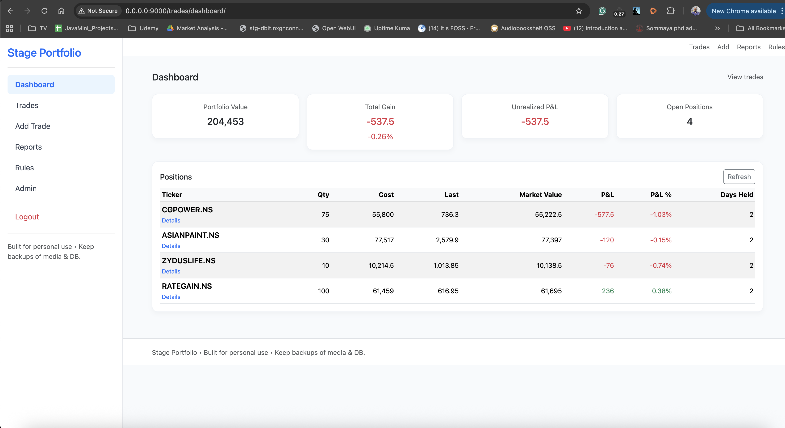
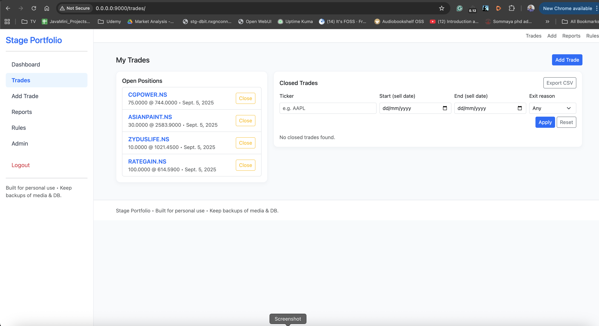
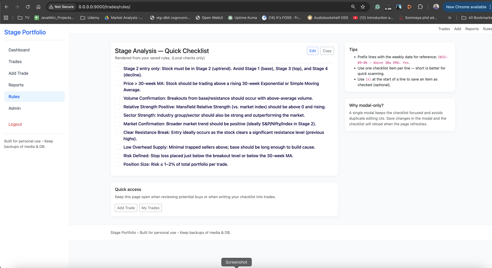
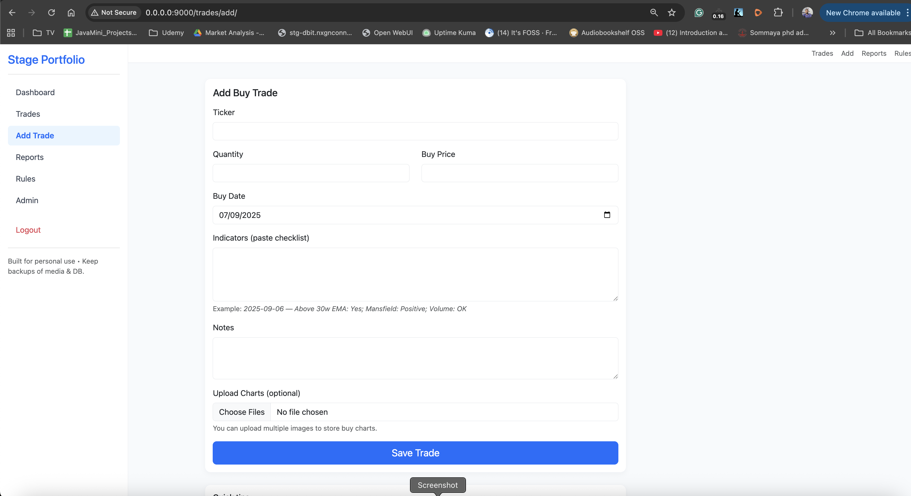

# 📊 Stage Analysis Portfolio Tracker

A **personal Django web app** to track trades using Stan Weinstein’s Stage Analysis.  
Mobile-friendly, lightweight, and focused on **weekly Stage 2 entries and disciplined exits**.  

Features:
- User authentication (login/logout).
- Add, close, and manage trades.
- Attach notes, stage-2 conditions, and chart images to each trade.
- Dashboard with portfolio value, unrealized/realized P&L, gains %, and sortable table of positions.
- Reports: closed trades, win rate, CSV export.
- Rules page: personal Stage Analysis checklist with interactive checkboxes + modal editor.
- Admin: full management of trades, charts, rules, and activity logs.
- Activity log: every add/close/upload logged with user and timestamp.

---

## 🚀 Quickstart

### 1. Clone & install
```bash
git clone https://github.com/yourusername/stage-portfolio.git
cd stage-portfolio
python -m venv .venv
source .venv/bin/activate
pip install -r requirements.txt
```

### 2. Configure settings

Create .env or update portfolio/settings.py:

```python
SECRET_KEY = "your-secret-key"
DEBUG = True
ALLOWED_HOSTS = []
```

Add your database settings if not using SQLite.

### 3. Run migrations

```bash
python manage.py migrate
```

### 4. Create a superuser

```bash
python manage.py createsuperuser
```

### 5. Start server
```bash
python manage.py runserver
```

Visit: http://127.0.0.1:8000 → you’ll land on the login page.

### App Structure 

```bash
trades/               
  ├── models.py       # Trade, TradeChart, Rules, ActivityLog
  ├── views.py        # add_trade, close_trade, dashboard, reports, rules_page
  ├── forms.py        # styled ModelForms for trades & charts
  ├── urls.py         # app routes
  ├── templates/      
  │   ├── trades/     # add_trade, close_trade, dashboard, reports, rules_page, trade_list, trade_detail
  │   └── registration/login.html   # login page
  └── admin.py        # admin with inlines + CSV export
```
📘 Documentation
📘 [User Guide](./USER_GUIDE.md)

📸 Screenshots

Dashboard view: 

Trades list: 

Rules page: 

Add trade form: 

🔐 Authentication
	-	Root (/) redirects to login.
	-	All main views require login (@login_required).
	-	After login → dashboard.
	-	Logout → back to login.

### 📊 Core workflows

Add a trade

-	Fill in ticker (ex TCS.NS for yahoo api), quantity, buy price, buy date.
-	Paste Stage 2 conditions checklist (indicators).
-	Upload buy charts.
•	Save → trade appears in dashboard + open positions.

Close a trade

-	Enter sell info, exit reason, notes, and optional sell charts.
-	Trade moves to Reports.

Reports

-	Summary: closed trades, wins, win rate.
-	Closed trades table with green/red P&L.
-	Export CSV.

Rules

- Interactive checklist with modal editor.
- Quick copy to paste into trades.
- Keep rules visible for discipline.


Admin

-	Manage all models via /admin/.
-	Inline charts in trades.
-	Export CSV from list view.
-	Activity logs for audit trail.
